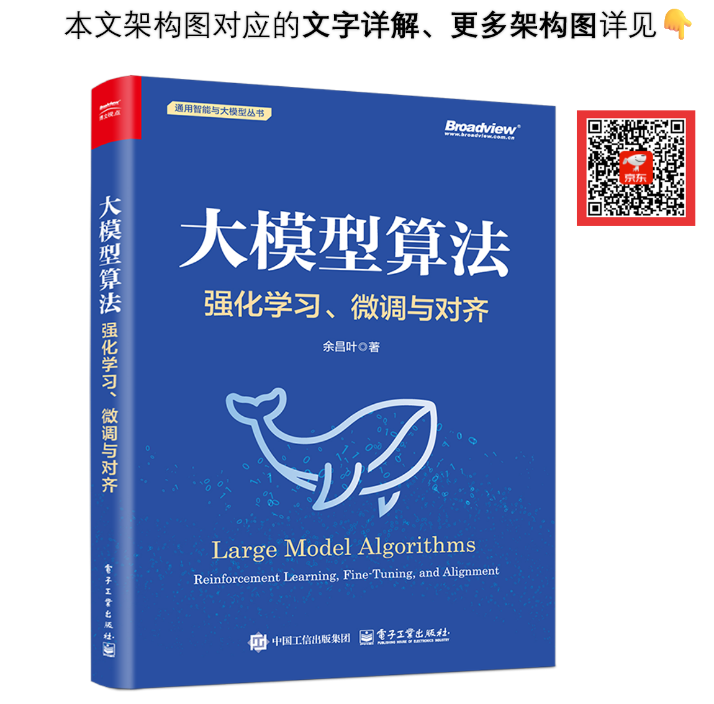

# 附錄與引用

## 本倉圖片的文字詳解、更多圖見：《大型模型演算法：強化學習、微調與對齊》
### 書籍目錄
#### 
<details>
<summary>摺疊 / 展開目錄</summary>

```python
第1章 大模型原理與技術概要
    1.1 圖解大模型結構
        1.1.1 大語言模型（LLM）結構全景圖
        1.1.2 輸入層：分詞、Token對映與向量生成
        1.1.3 輸出層：Logits、機率分佈與解碼
        1.1.4 多模態語言模型（MLLM）與視覺語言模型（VLM）
    1.2 大模型訓練全景圖
    1.3 Scaling Law（效能的四大擴充套件規律）
第2章 SFT（監督微調）
    2.1 多種微調技術圖解
        2.1.1 全引數微調、部分引數微調
        2.1.2 LoRA（低秩適配微調）——四兩撥千斤
        2.1.3 LoRA衍生：QLoRA、AdaLoRA、PiSSA等
        2.1.4 基於提示的微調：Prefix-Tuning、Prompt Tuning等
        2.1.5 Adapter Tuning
        2.1.6 微調技術對比
        2.1.7 如何選擇微調技術
    2.2 SFT原理深入解析
        2.2.1 SFT資料與ChatML格式化
        2.2.2 Logits與Token機率計算
        2.2.3 SFT的Label
        2.2.4 SFT的Loss圖解
        2.2.5 對數機率（LogProbs）與LogSoftmax
    2.3 指令收集和處理
        2.3.1 收集指令的渠道和方法
        2.3.2 清洗指令的四要素
        2.3.3 資料預處理及常用工具
    2.4 SFT實踐指南
        2.4.1 如何緩解SFT引入的幻覺？
        2.4.2 Token級Batch Size的換算
        2.4.3 Batch Size與學習率的Scaling Law
        2.4.4 SFT的七個技巧
第3章 DPO（直接偏好最佳化）
    3.1 DPO的核心思想
        3.1.1 DPO的提出背景與意義
        3.1.2 隱式的獎勵模型
        3.1.3 Loss和最佳化目標
    3.2 偏好資料集的構建
        3.2.1 構建流程總覽
        3.2.2 Prompt的收集
        3.2.3 問答資料對的清洗
        3.2.4 封裝和預處理
    3.3 圖解DPO的實現與訓練
        3.3.1 模型的初始化
        3.3.2 DPO訓練全景圖
        3.3.3 DPO核心程式碼的提煉和解讀
    3.4 DPO實踐經驗
        3.4.1 β引數如何調節
        3.4.2 DPO對模型能力的多維度影響
    3.5 DPO進階
        3.5.1 DPO和RLHF（PPO）的對比
        3.5.2 理解DPO的梯度
第4章 免訓練的效果最佳化技術
    4.1 提示工程
        4.1.1 Zero-Shot、One-Shot、Few-Shot
        4.1.2 Prompt設計的原則
    4.2 CoT（思維鏈）
        4.2.1 CoT原理圖解
        4.2.2 ToT、GoT、XoT等衍生方法
        4.2.3 CoT的應用技巧
        4.2.4 CoT在多模態領域的應用
    4.3 生成控制和解碼策略
        4.3.1 解碼的原理與分類
        4.3.2 貪婪搜尋
        4.3.3 Beam Search（波束搜尋）：圖解、衍生方法
        4.3.4 Top-K、Top-P等取樣方法圖解
        4.3.5 其他解碼策略
        4.3.6 多種生成控制引數
    4.4 RAG（檢索增強生成）
        4.4.1 RAG技術全景圖
        4.4.2 RAG相關框架
    4.5 功能與工具呼叫（Function Calling）
        4.5.1 功能呼叫全景圖
        4.5.2 功能呼叫的分類
第5章 強化學習基礎
    5.1 強化學習核心
        5.1.1 強化學習：定義與區分
        5.1.2 強化學習的基礎架構、核心概念
        5.1.3 馬爾可夫決策過程（MDP）
        5.1.4 探索與利用、ε-貪婪策略
        5.1.5 同策略（On-policy）、異策略（Off-policy）
        5.1.6 線上/離線強化學習（Online/Offline RL）
        5.1.7 強化學習分類圖
    5.2 價值函式、回報預估
        5.2.1 獎勵、回報、折扣因子（R、G、γ）
        5.2.2 反向計算回報
        5.2.3 四種價值函式：Qπ、Vπ、V*、Q*
        5.2.4 獎勵、回報、價值的區別
        5.2.5 貝爾曼方程——強化學習的基石
        5.2.6 Q和V的轉換關係、轉換圖
        5.2.7 蒙特卡洛方法（MC）
    5.3 時序差分（TD）
        5.3.1 時序差分方法
        5.3.2 TD-Target和TD-Error
        5.3.3 TD(λ)、多步TD
        5.3.4 蒙特卡洛、TD、DP、窮舉搜尋的區別
    5.4 基於價值的演算法
        5.4.1 Q-learning演算法
        5.4.2 DQN
        5.4.3 DQN的Loss、訓練過程
        5.4.4 DDQN、Dueling DQN等衍生演算法
    5.5 策略梯度演算法
        5.5.1 策略梯度（Policy Gradient）
        5.5.2 策略梯度定理
        5.5.3 REINFORCE和Actor-Critic：策略梯度的應用
    5.6 多智慧體強化學習（MARL）
        5.6.1 MARL的原理與架構
        5.6.2 MARL的建模
        5.6.3 MARL的典型演算法
    5.7 模仿學習（IL）
        5.7.1 模仿學習的定義、分類
        5.7.2 行為克隆（BC）
        5.7.3 逆向強化學習（IRL）
        5.7.4 生成對抗模仿學習（GAIL）
    5.8 強化學習高階拓展
        5.8.1 基於環境模型（Model-Based）的方法
        5.8.2 分層強化學習（HRL）
        5.8.3 分佈價值強化學習（Distributional RL）
第6章 策略最佳化演算法
    6.1 Actor-Critic（演員-評委）架構
        6.1.1 從策略梯度到Actor-Critic
        6.1.2 Actor-Critic架構圖解
    6.2 優勢函式與A2C
        6.2.1 優勢函式（Advantage）
        6.2.2 A2C、A3C、SAC演算法
        6.2.3 GAE（廣義優勢估計）演算法
        6.2.4 γ和λ的調節作用
    6.3 PPO及其相關演算法
        6.3.1 PPO演算法的演進
        6.3.2 TRPO（置信域策略最佳化）
        6.3.3 重要性取樣（Importance Sampling）
        6.3.4 PPO-Penalty
        6.3.5 PPO-Clip
        6.3.6 PPO的Loss的擴充套件
        6.3.7 TRPO與PPO的區別
        6.3.8 圖解策略模型的訓練
        6.3.9 深入解析PPO的本質
    6.4 GRPO演算法
        6.4.1 GRPO的原理
        6.4.2 GRPO與PPO的區別
    6.5 確定性策略梯度（DPG）
        6.5.1 確定性策略vs隨機性策略
        6.5.2 DPG、DDPG、TD3演算法
第7章 RLHF與RLAIF
    7.1 RLHF（基於人類反饋的強化學習）概要
        7.1.1 RLHF的背景、發展
        7.1.2 語言模型的強化學習建模
        7.1.3 RLHF的訓練樣本、總流程
    7.2 階段一：圖解獎勵模型的設計與訓練
        7.2.1 獎勵模型（Reward Model）的結構
        7.2.2 獎勵模型的輸入與獎勵分數
        7.2.3 獎勵模型的Loss解析
        7.2.4 獎勵模型訓練全景圖
        7.2.5 獎勵模型的Scaling Law
    7.3 階段二：多模型聯動的PPO訓練
        7.3.1 四種模型的角色圖解
        7.3.2 各模型的結構、初始化、實踐技巧
        7.3.3 各模型的輸入、輸出
        7.3.4 基於KL散度的策略約束
        7.3.5 基於PPO的RLHF核心實現
        7.3.6 全景圖：基於PPO的訓練
    7.4 RLHF實踐技巧
        7.4.1 獎勵欺騙（Reward Hacking）的挑戰與應對
        7.4.2 拒絕取樣（Rejection Sampling）微調
        7.4.3 強化學習與RLHF的訓練框架
        7.4.4 RLHF的超引數
        7.4.5 RLHF的關鍵監控指標
    7.5 基於AI反饋的強化學習
        7.5.1 RLAIF的原理圖解
        7.5.2 CAI：基於憲法的強化學習
        7.5.3 RBR：基於規則的獎勵
第8章 邏輯推理能力最佳化
    8.1 邏輯推理（Reasoning）相關技術概覽
        8.1.1 推理時計算與搜尋
        8.1.2 基於CoT的蒸餾
        8.1.3 過程獎勵模型與結果獎勵模型（PRM/ORM）
        8.1.4 資料合成
    8.2 推理路徑搜尋與最佳化
        8.2.1 MCTS（蒙特卡洛樹搜尋）
        8.2.2 A*搜尋
        8.2.3 BoN取樣與蒸餾
        8.2.4 其他搜尋方法
    8.3 強化學習訓練
        8.3.1 強化學習的多種應用
        8.3.2 自博弈（Self-Play）與自我進化
        8.3.3 強化學習的多維創新
第9章 綜合實踐與效能最佳化
    9.1 實踐全景圖
    9.2 訓練與部署
        9.2.1 資料與環境準備
        9.2.2 超引數如何設定
        9.2.3 SFT訓練
        9.2.4 對齊訓練：DPO訓練、RLHF訓練
        9.2.5 推理與部署
    9.3 DeepSeek的訓練與本地部署
        9.3.1 DeepSeek的蒸餾與GRPO訓練
        9.3.2 DeepSeek的本地部署與使用
    9.4 效果評估
        9.4.1 評估方法分類
        9.4.2 LLM與VLM的評測框架
    9.5 大模型效能最佳化技術圖譜
```

</details>



## 參考文獻
- 《大型模型演算法：強化學習、微調與對齊》原書的參考文獻詳見： [參考文獻](references.md) 

---
