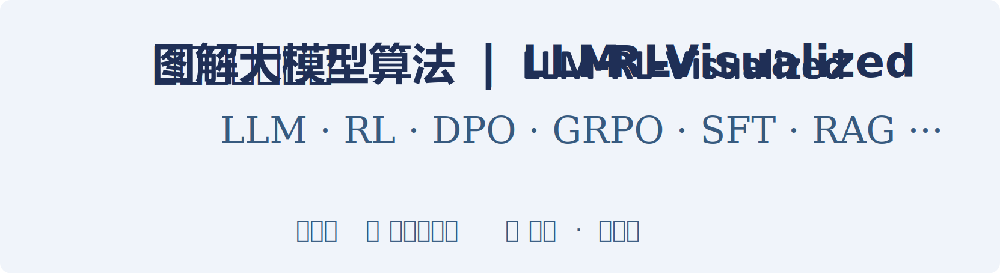

# 圖解大型模型演算法：LLM / RL / VLM 核心技術圖譜

  

  
  &nbsp; &nbsp;&nbsp;
  

## 簡 介

🎉 **原創 100+ 架構圖，系統講解大型模型、強化學習**，涵蓋：LLM / VLM 等大型模型原理、訓練演算法（RL、RLHF、GRPO、DPO、SFT 與 CoT 蒸餾等）、效果最佳化與 RAG 等。  

🎉 關於架構圖<strong>更詳細</strong>的解讀可參考：<a href="https://book.douban.com/subject/37331056/">《大型模型演算法：強化學習、微調與對齊》</a> (豆瓣高分，多次京東AI圖書Top 5 ！)

🎉 本儲存庫**長期勘誤、追加**，歡迎點選儲存庫上方的 **Star ⭐** 關注，感謝鼓勵✨

🎉 點擊圖片可看高解析度大圖，或瀏覽儲存庫目錄中的 `.svg` 格式向量圖（活圖，可無限縮放、可選擇文字）

---

## 導航

- [第1部分：大型模型、強化學習的技術全景圖](part-01-overview.md)
- [第2部分：大型模型基礎](part-02-llm-basics.md)
- [第3部分：SFT（有監督微調）](part-03-sft.md)
- [第4部分：DPO（直接偏好最佳化）](part-04-dpo.md)
- [第5部分：免訓練的大型模型最佳化技術](part-05-optimization-without-training.md)
- [第6部分：強化學習（RL）基礎](part-06-rl-basics.md)
- [第7部分：策略最佳化架構及衍生演算法](part-07-policy-optimization.md)
- [第8部分：RLHF 與 RLAIF](part-08-rlhf-rlaif.md)
- [第9部分：邏輯推理（Reasoning）能力最佳化](part-09-reasoning.md)
- [第10部分：大型模型基礎拓展](part-10-llm-advanced.md)
- [附錄與引用](appendix.md)
- [參考文獻](references.md)

  

