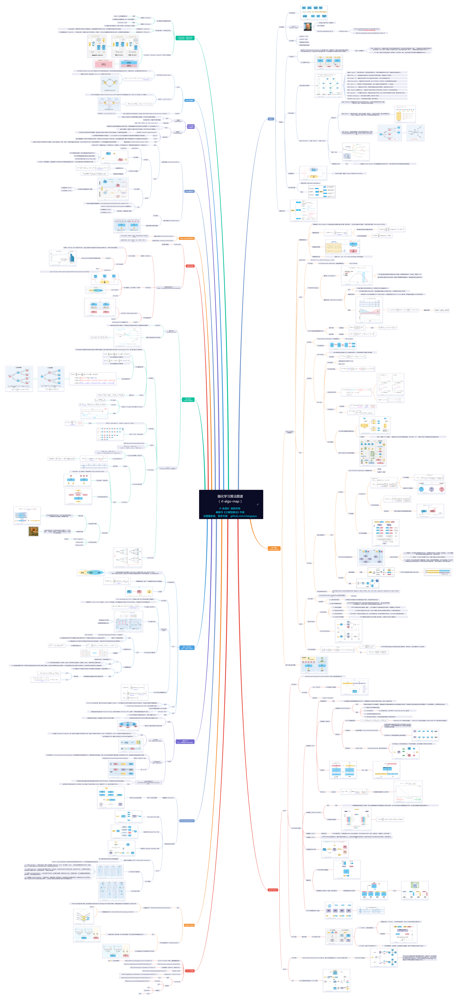

# 第1部分：大型模型、強化學習的技術全景圖

## 大型模型演算法總體架構（以LLM、VLM為主）

## 強化學習演算法圖譜 (rl-algo-map).pdf——全網最大！
- 本人歷時數天、嘔心瀝血之作，點選本儲存庫右上角 ↗ 的 **Star ⭐** ，就是對我最大的鼓勵啦！
- 下圖僅為預覽圖，高解析度圖見： <a href="files/%E5%BC%BA%E5%8C%96%E5%AD%A6%E4%B9%A0%E7%AE%97%E6%B3%95%E5%9B%BE%E8%B0%B1%20%28rl-algo-map%29.pdf"> 強化學習演算法圖譜 (rl-algo-map).pdf </a>

## 【LLM基礎】LLM結構總圖——全網最大！
- 本人歷時幾十個小時、嘔心瀝血之作，點選本儲存庫右上角 ↗ 的 **Star ⭐** ，就是對我最大的鼓勵啦！
- LLM主要有Decoder-Only（僅解碼器）或MoE（Mixture of Experts, 專家混合模型）兩種形式，兩者在整體架構上較為相似，主要區別為MoE在FFN（前饋網路）部分引入了多個專家網路。

## 策略梯度(Policy Gradient)-強化學習(PPO&GRPO等)之根基.pdf
- 手撕推導 RL 核心理論之一 ，圖靈獎得主 Sutton 提出。
- 大型模型訓練演算法之根基（被ChatGPT、DeepSeek 等廣泛使用的 PPO 和 GRPO 演算法都是基於策略梯度）。
- 很重要 但常常被混淆的一部分內容，我重新推導公式、畫原理圖解釋了一下（窄版排版） :
<a href="files/%E7%AD%96%E7%95%A5%E6%A2%AF%E5%BA%A6%28Policy%20Gradient%29-%E5%BC%BA%E5%8C%96%E5%AD%A6%E4%B9%A0%28PPO%26GRPO%E7%AD%89%29%E4%B9%8B%E6%A0%B9%E5%9F%BA.pdf"> 策略梯度(Policy Gradient)-強化學習(PPO&GRPO等)之根基.pdf </a>
